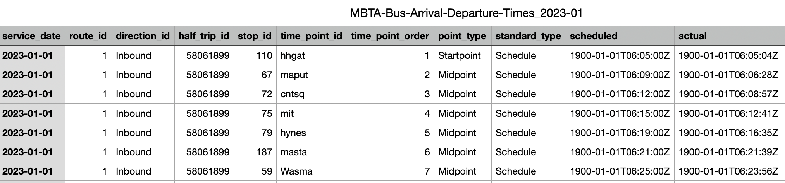
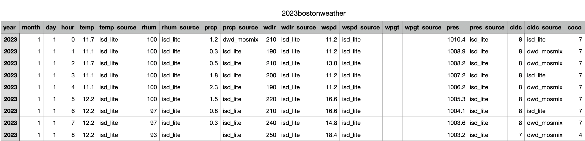
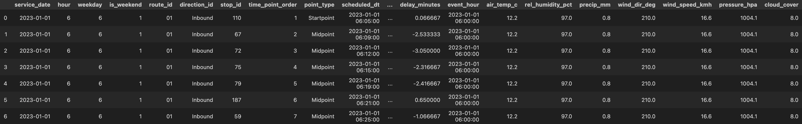

# Midterm report

## Presentation link
[https://www.youtube.com/watch?v=AJF210YWvrs](https://www.youtube.com/watch?v=AJF210YWvrs)
## Description
Most of the college students use MBTA as commution method. However, because of the frequent delay of MBTA‘ transit vehicles, students usually suffer from it, being late to the class or even missing the final exam. MBTA delays because of multiple factors, and we want to figure it out, studying the long-term pattern of MBTA. We are interested in investigating the weight of different factors that can affect MBTA's arrival time.

## Goal
 
### Primary Goal
Predict the binary result if MBTA bus will delay or not based factors we consider.

### Research Goal 
Study the relationships between delay and different factors.

## Data Sources

### MBTA Open Data Portal
[https://mbta-massdot.opendata.arcgis.com/](https://mbta-massdot.opendata.arcgis.com/)  
Provides open public data on MBTA bus operations for **2023–2024**, including:
- Scheduled and actual arrival/departure times  
- Routes, stops, and direction information  

### Meteostat Developers
[https://dev.meteostat.net/](https://dev.meteostat.net/)  
Provides corresponding **weather-related data** for the Boston area from **2023–2024**, including:
- Temperature, humidity, precipitation, pressure, wind speed and direction, cloud cover, and encoded weather conditions  

## Dataset Overview
Before cleaning, the raw data consists of:
- 24 monthly MBTA bus tables (2023–2024)  

- 2 yearly weather tables (2023–2024)  

These tables are later processed and combined into a single integrated dataset.  

---

## Bus Data Processing

The first step focuses on cleaning and preparing the MBTA bus dataset.

1. **Merging and Cleaning**  
   All 24 monthly MBTA bus CSV files are merged into a single dataset.  
   Duplicate rows are removed to ensure data consistency.

 **→ Code snippet here:**
   ```python
    files_2023 = glob.glob(os.path.join(path_2023, "*.csv"))  #match and get all csv files under the variables
    files_2024 = glob.glob(os.path.join(path_2024, "*.csv"))
    all_files = files_2023 + files_2024 #merge two files
    dataframes = []
    for i, file in enumerate(all_files):
    df = pd.read_csv(file)
    dataframes.append(df)   
    bus_all = pd.concat(dataframes, ignore_index=True)   # merge the files by rows, ignore_index= True: generate new row numbers
    bus_all = bus_all.drop_duplicates() #remove all duplicate row information   
```

2. **Timestamp Conversion**  
   All time-related columns (e.g., `scheduled_dt`, `actual_dt`, `service_date`) are converted into standardized datetime type  and format to allow for temporal operations.

3. **Feature Creation**  
   A new column, `delay`, is computed as the difference between actual and scheduled arrival times.  
   Additionally, time-based features including `hour`, `weekday`, and `is_weekend` are extracted to capture potential patterns related to rush hours and weekend effects.

**→ Code snippet here:**
```python
bus_all["hour"] = bus_all["scheduled_dt"].dt.hour
bus_all["weekday"] = bus_all["scheduled_dt"].dt.weekday  # 0=Mon, 6=Sun
bus_all["is_weekend"] = bus_all["weekday"].isin([5,6]).astype(int)

```

4. **Column Selection**  
   Only relevant and reliable variables — such as service date, route, stop, direction, and computed delay — are retained.  
   The cleaned bus dataset is saved for later modeling and integration.

partial output:

---

## Weather Data Processing

Before integration, the Meteostat weather data undergoes a preprocessing stage to ensure compatibility with the bus dataset.

1. **Data Combination and Cleaning**  
   The 2023 and 2024 weather tables are combined into one dataset.  
   Unnecessary or redundant columns (e.g., metadata fields ending in `_source`) are removed.

2. **Timestamp Alignment**  
   Hour-level timestamps are created by combining year, month, day, and hour columns.  
   These timestamps will later be used to match the bus records based on event hour.

**→ Code snippet here:**
```python
    weather_raw["timestamp_hour"] = pd.to_datetime(
    weather_raw[["year", "month", "day", "hour"]]
)
```
3. **Feature Selection and Labeling**  
   Key variables such as temperature, humidity, precipitation, and wind speed are retained.  
   Weather condition codes are mapped to human-readable labels (e.g., *Clear*, *Cloudy*, *Rain*, *Snow*) for improved readability.

The resulting weather dataset is concise, structured, and ready to be joined with the bus dataset.

---

## Data Integration

After both datasets are cleaned, the next step is to combine them into a single integrated table.

1. **Timestamp Matching**  
   Bus timestamps are rounded down to the nearest hour to align with hourly weather records.  
   Each bus record is then matched to the corresponding weather conditions based on the same hour.

2. **Merging**  
   The cleaned bus dataset and weather dataset are merged using a left join on the matching hour keys.  
   This ensures that every bus record includes the relevant environmental context.

3. **Post-Merge Cleaning**  
   Duplicate and missing rows are removed to maintain data quality.  
   The merged dataset is then saved for modeling.

---

## Final Integrated Dataset

The final dataset contains approximately **46 million rows** and **22 variables**, integrating both operational and environmental features.

- **Bus-related variables:** route ID, stop ID, direction ID, scheduled and actual timestamps, delay in seconds/minutes.  
- **Time-related variables:** hour, weekday, weekend indicator.  
- **Weather-related variables:** air temperature, relative humidity, precipitation, wind speed and direction, air pressure, cloud cover, and weather condition label.



---

## Preliminary Findings Report

## Project Framing
- Objective: explore MBTA bus performance alongside weather signals to flag conditions associated with late arrivals.
- Scope so far: built an exploratory notebook (`analysis/preliminary_feature_exploration.ipynb`) for quick feature triage and a reproducible logistic regression pipeline (`analysis/logistic_regression_pipeline.py`).

## Hypotheses at Kickoff
- **Weather-driven delays:** Heavy precipitation, high wind speeds, and low visibility (cloud cover) increase the chance of delays.
- **Temporal patterns:** Rush-hour windows and certain weekdays are more delay-prone due to traffic and ridership peaks.
- **Route/stop variability:** A handful of routes and stops drive most of the observed delays, making localized interventions viable.

## Evidence Gathered
- Load the full 46M-row `bus_weather_clean.csv` by default, with an opt-in sampling knob for lower-memory environments.
- Generate descriptive statistics and missing-value audits to understand data hygiene before modeling.
- Visual inspections (delay histograms, categorical frequency bars, robust hourly median plots, and weather-condition rankings) highlight long-tailed delay distributions and contextualize where congestion and weather stressors appear.
- Logistic regression pipeline encodes categorical features, scales numeric fields, and evaluates on a stratified test split with saved diagnostics (metrics JSON, ROC curve).

## Discoveries So Far
- Delay minutes are highly skewed: most trips arrive on time or a few minutes late, but a meaningful tail reaches 10+ minutes.
- Hour-of-day and weekday effects corroborate the rush-hour hypothesis—early morning and evening windows yield higher median delays than off-peak periods even after filtering low-volume hours.
- Heavy precipitation and elevated wind speeds lead the weather-driven delay rankings, while fair-weather conditions stay near zero; temperature shows a muted relationship.
- **Current logistic regression performance:** Accuracy 0.65 and ROC-AUC 0.69 on the test split. Precision 0.72 and recall 0.65 for the delayed class indicate the model captures most true delays with manageable false positives, yet still misses roughly one-third of actual delays. The model serves as an interpretable baseline with room to grow.

## Challenges and Mitigations
- **File size:** The raw CSV is several gigabytes. Solution: default to full-load for completeness, but keep optional sampling and chunked stats utilities so lower-memory runs remain feasible.
- **Feature completeness:** Mixed data types and missing values required explicit coercion and light engineering (e.g., converting wind direction into sine/cosine components) before modeling.
- **Class imbalance:** Delayed trips are less frequent than on-time trips. Stratified splits and threshold-aware metrics (precision/recall) keep evaluation honest, but the imbalance still affects recall.

## Next Steps
- Expand feature set with temporal aggregates and route-level profiles.
- Trial more expressive models to close the recall gap while monitoring interpretability.
- Operationalize visual dashboards for stakeholders, focusing on high-delay routes/weather combinations surfaced during EDA.
- Investigate real-time inference feasibility once a stronger model is in place.

---

# Modeling Method 
## Logistic Regression Workflow

This document explains the logistic regression analysis used to predict MBTA bus delays from the combined schedule and weather dataset (`bus_weather_clean.csv`). The goal is to produce a defendable baseline model, understand feature relationships, and generate visuals that support the project’s proposal.

### Why Logistic Regression?
- Establishes a transparent, interpretable baseline for the binary delay prediction task before exploring heavier models (tree ensembles, deep nets).
- Outputs calibrated class probabilities that feed nicely into evaluation tools such as ROC curves.
- Works well with both numerical and categorical predictors when paired with standard preprocessing.

### Dataset & Label Definition
- Source: `bus_weather_clean.csv` (MBTA stop-level data enriched with weather observations).
- Target: Trips are labelled delayed if `delay_minutes` ≥ 1 minute (default threshold configurable via `--delay-threshold`).
- Sampling: Script limits the initial read (`--max-rows`) and optional random down-sampling (`--sample-frac`) to keep memory usage manageable with the 7.8 GB CSV.

### Feature Engineering & Preprocessing
- Selected columns only (see `USECOLS` in `analysis/logistic_regression_pipeline.py`) to avoid loading unused data.
- Temporal fields: `service_date` converted to datetime so we can group by date/hour for heatmap visuals.
- Categorical identifiers (`route_id`, `direction_id`, `point_type`, `weather_condition`) coerced to strings, cleaned, and one-hot encoded.
- Circular wind direction represented via sine/cosine projections to preserve orientation information.
- Numeric features (hour, humidity, precipitation, etc.) imputed with medians and scaled; categorical features imputed with most-frequent values.
- Pipeline uses `class_weight="balanced"` to compensate for any class imbalance during training.

### Model & Evaluation
- Train/test split: 80/20 with stratification to maintain the delay rate distribution.
- Logistic regression (`lbfgs`, 1000 iterations) fitted within an sklearn `Pipeline`, ensuring preprocessing is identical during train and inference.
- Metrics captured: accuracy, ROC-AUC, confusion matrix, and full classification report; saved to `outputs/logistic_regression_metrics.json`.
- Example run (60k-row sample): Accuracy ≈ 0.65, ROC-AUC ≈ 0.69 (actual numbers depend on sampling).

### Visualizations
All figures are saved under the directory chosen via `--outputs-dir` (defaults to `outputs/`):
- Box plots comparing delayed vs. on-time trips for temperature, precipitation, wind speed, and cloud cover.
- Heatmap showing average delay minutes by service date and hour (capped to recent 21 days to keep it readable).
- ROC curve plot for the logistic regression model.

### Running the Pipeline
Install dependencies in your Python environment:
```bash
pip install pandas seaborn matplotlib scikit-learn
```
Execute the analysis (adjust limits for your hardware):
```bash
python analysis/logistic_regression_pipeline.py --max-rows 300000 --sample-frac 0.2 --outputs-dir outputs
```
Key flags:
- `--max-rows`: Number of rows read from the CSV (set `-1` for full dataset once memory allows).
- `--sample-frac`: Additional random down-sampling (0 < value ≤ 1).
- `--delay-threshold`: Minutes defining a “delay” (default 1.0).
- `--test-size`: Hold-out fraction (default 0.2).

### Interpreting Results
- Use the ROC curve and metrics JSON to evaluate baseline performance and document baseline findings.
- Box plots highlight which weather features shift distributions when delays occur.
- Heatmap reveals temporal hotspots (days/hours) with systemic delays, guiding further investigation.

### Next Steps
- Compare against non-linear models (decision tree, XGBoost, neural nets) using the same engineered features.
- Perform threshold analysis by sweeping `--delay-threshold` to see how the positive rate and performance trade off.
- Incorporate SHAP values or coefficient inspection for deeper feature contribution insights.


---

## Predicting MBTA Bus Delays with Random Forest

Our group predicts **MBTA Bus Delays** using a **Random Forest Classifier**.

---

### Goal
Given schedule, weather, and calendar features, our goal is to **predict whether an MBTA bus trip will be delayed or not**.

---

### Features Used
We combined schedule data from the MBTA API with hourly weather records.

- **Temporal features:** `service_date`, `hour` of day, `weekday`, `is_weekend`, and `is_holiday`  
- **Route metadata:** `route_id`, `stop_id`, `direction_id`  
- **Weather features:** `temperature`, `precipitation`, `wind_speed_kmh`  
- **Environmental variables:** `pressure_hpa`, `cloud_cover`

The target label is binary:  
> `1` if the delay exceeds **5 minutes**, otherwise `0`.

We used **80% of the data for training** and **20% for testing**.

---

### ⚙️ Data Processing & Caching
To keep iteration fast, we implemented a **caching system**.  
After the first full data processing, the cleaned dataset is saved as a cached artifact.  
Subsequent model training runs simply reload from the cache—saving significant time.

---

### Model Configuration
We chose **Random Forest** to capture non-linear relationships and feature interactions without requiring extensive feature engineering.

**Parameters:**
- `n_estimators = 200`
- `max_depth = 14`
- `min_samples_leaf = 25`
- `max_features = log2`
- `max_samples = 0.3`

The model was trained on a **20-million-row dataset** for about **30 minutes**.

---

### Results
Our Random Forest model, trained on **24 months of MBTA and weather data**, achieved:

| Metric | Score |
|---------|--------|
| **Accuracy** | ~0.60 |
| **Recall (Delayed)** | ~0.63 |
| **ROC-AUC** | 0.65 |
| **PR-AUC** | 0.46 |

The model correctly identified about **63% of actual delays**, demonstrating meaningful predictive power in a noisy, real-world dataset.

---

### Key Insights
Feature importance analysis revealed that:
- **Hour of day**, **precipitation**, and **route ID** are the dominant factors.
- Timing and weather conditions are the strongest predictors of bus delays.

---

### Next Steps
- Add **rolling historical delay averages** per stop and hour to capture temporal context.  
- **Tune classification thresholds** to improve the precision–recall trade-off.  
- Calibrate probability outputs for better reliability in real-world deployment.

---


