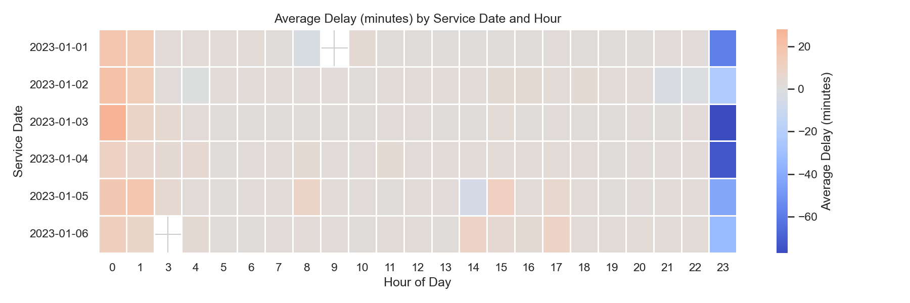
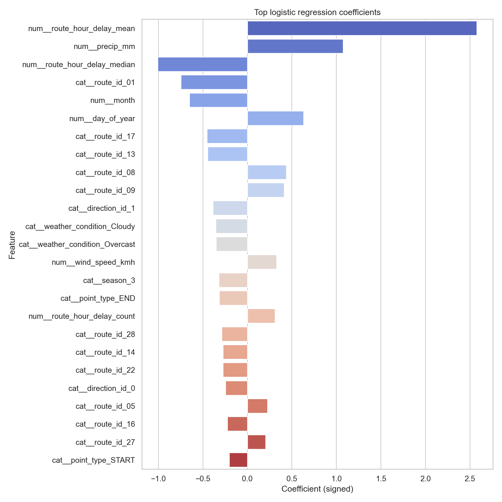

# MBTA Bus Delay Intelligence Hub

Welcome to the documentation for our CS506 final project. This README consolidates our data sources, engineering steps, visualization catalog, and modeling performance for predicting MBTA bus delays with both interpretable (logistic regression) and non-linear (random forest) pipelines.

---

## Quick Links
- **Presentation video:** [YouTube](https://www.youtube.com/watch?v=xA2GOnq4TFE&t=9s)
- **Data cleaning and processing notebook:** 
   - `data/merge_bus.ipynb` (outputs in `data/processdata/bus_clean.csv`)
   - `data/mergebuscleanwithweather.ipynb`(outputs in `data/processdata/bus_weather_clean.csv`)


- **Logistic notebook:** `logistic_regression_analysis.ipynb` (outputs in `outputs/logistic_notebook/`)
- **Random-forest trainer:** `train_rf_bus.py` (artifacts in `outputs/`)
- **Exploratory notebook:** `preliminary_feature_exploration.ipynb`
- **Metrics files:** `outputs/logistic_regression_metrics.json`, `metrics.txt`, `training_summary.json`

---

## Build & Run (Reproducibility First)

1. **Prerequisites**
   - Python 3.11+ and `pip`.
   - `make` (GNU Make). On Windows without `make`, run the equivalent commands in PowerShell (instructions below).
   - `bus_weather_clean.csv` placed in the repo root (or pass `--csv-path` overrides).

2. **Install dependencies**
   ```bash
   make -f Makefile_data install
   make -f Makefile_linear install
   make -f Makefile_rf install
   ```
   _Windows without `make`_: `python -m venv .venv && .\.venv\Scripts\activate && pip install -r requirements_data.txt -r requirements_linear.txt -r requirements_RF.txt` 

3. **Build integrated bus + weather dataset (from raw MBTA + Meteostat files)**  
   
   ```bash
   # build data/processdata/bus_clean.csv and data/processdata/bus_weather_clean.csv
   make -f Makefile_data data
   ```

4. **Build the shared processed cache**
   ```bash
   make -f Makefile_linear cache CSV=bus_weather_clean.csv
   ```
   _Manual alternative_: `python -c "from pathlib import Path; from data_loader import load_or_build_processed_df; load_or_build_processed_df(Path('bus_weather_clean.csv'), Path('outputs/cache'))"`

5. **Train models**
   - Logistic regression CLI:
     ```bash
     make -f Makefile_linear train-logistic CSV=bus_weather_clean.csv OUT_LOG=outputs/logistic_regression
     ```
   - Gradient-descent CLI:
     ```bash
     make -f Makefile_linear train-gd CSV=bus_weather_clean.csv OUT_GD=outputs/gradient_descent
     ```
   - Random forest:
     ```bash
     make -f Makefile_rf cache CSV=bus_weather_clean.csv OUT=artifacts
     make -f Makefile_rf train CSV=bus_weather_clean.csv OUT=artifacts
     ```

5. **Score new data**
   ```bash
   python predict_linear.py --model outputs/logistic_regression/logistic_regression_model.joblib \
     --input my_hourly_features.csv --output preds_logistic.csv --threshold 0.5
   python predict_rf.py --model artifacts/model.joblib --input my_hourly_features.csv --output preds_rf.csv
   ```

All artifacts referenced in this README live under the committed `outputs/` snapshots (including `outputs/logistic_notebook/` and `outputs/gradient_descent_notebook/`) or the RF trainer's `artifacts/` directory after running the commands above.

---

## Problem Statement
MBTA buses are a primary commute option for Boston-area students. Chronic delays ripple into missed lectures, exams, and work shifts. We ingest two years of MBTA schedule/operations logs and Meteostat weather observations to learn which contextual signals (weather, temporal, route-specific effects) drive delays and to predict whether an upcoming trip will be late.

---


## Data Sources

### MBTA Open Data Portal
[https://mbta-massdot.opendata.arcgis.com/](https://mbta-massdot.opendata.arcgis.com/)  
Provides open public data on MBTA bus operations for **2023–2024**, including:
- Scheduled and actual arrival/departure times  
- Routes, stops, and direction information  

### Meteostat Developers
[https://dev.meteostat.net/](https://dev.meteostat.net/)  
Provides corresponding **weather-related data** for the Boston area from **2023–2024**, including:
- Temperature, humidity, precipitation, pressure, wind speed and direction, cloud cover, and encoded weather conditions  

## Dataset Overview
Before cleaning, the raw data consists of:
- 24 monthly MBTA bus tables (2023–2024)  

- 2 yearly weather tables (2023–2024)  

These tables are later processed and combined into a single integrated dataset.  

---

## Bus Data Processing

The first step focuses on cleaning and preparing the MBTA bus dataset.

1. **Merging and Cleaning**  
   All 24 monthly MBTA bus CSV files are merged into a single dataset.  
   Duplicate rows are removed to ensure data consistency.

 **→ Code snippet here:**
   ```python
    files_2023 = glob.glob(os.path.join(path_2023, "*.csv"))  #match and get all csv files under the variables
    files_2024 = glob.glob(os.path.join(path_2024, "*.csv"))
    all_files = files_2023 + files_2024 #merge two files
    dataframes = []
    for i, file in enumerate(all_files):
    df = pd.read_csv(file)
    dataframes.append(df)   
    bus_all = pd.concat(dataframes, ignore_index=True)   # merge the files by rows, ignore_index= True: generate new row numbers
    bus_all = bus_all.drop_duplicates() #remove all duplicate row information   
```

2. **Timestamp Conversion**  
   All time-related columns (e.g., `scheduled_dt`, `actual_dt`, `service_date`) are converted into standardized datetime type  and format to allow for temporal operations.

3. **Feature Creation**  
   A new column, `delay`, is computed as the difference between actual and scheduled arrival times.  
   Additionally, time-based features including `hour`, `weekday`, and `is_weekend` are extracted to capture potential patterns related to rush hours and weekend effects.

**→ Code snippet here:**
```python
bus_all["hour"] = bus_all["scheduled_dt"].dt.hour
bus_all["weekday"] = bus_all["scheduled_dt"].dt.weekday  # 0=Mon, 6=Sun
bus_all["is_weekend"] = bus_all["weekday"].isin([5,6]).astype(int)

```

4. **Column Selection**  
   Only relevant and reliable variables — such as service date, route, stop, direction, and computed delay — are retained.  
   The cleaned bus dataset is saved for later modeling and integration.

partial output:

---

## Weather Data Processing

Before integration, the Meteostat weather data undergoes a preprocessing stage to ensure compatibility with the bus dataset.

1. **Data Combination and Cleaning**  
   The 2023 and 2024 weather tables are combined into one dataset.  
   Unnecessary or redundant columns (e.g., metadata fields ending in `_source`) are removed.

2. **Timestamp Alignment**  
   Hour-level timestamps are created by combining year, month, day, and hour columns.  
   These timestamps will later be used to match the bus records based on event hour.

**→ Code snippet here:**
```python
    weather_raw["timestamp_hour"] = pd.to_datetime(
    weather_raw[["year", "month", "day", "hour"]]
)
```
3. **Feature Selection and Labeling**  
   Key variables such as temperature, humidity, precipitation, and wind speed are retained.  
   Weather condition codes are mapped to human-readable labels (e.g., *Clear*, *Cloudy*, *Rain*, *Snow*) for improved readability.

The resulting weather dataset is concise, structured, and ready to be joined with the bus dataset.

---

## Data Integration

After both datasets are cleaned, the next step is to combine them into a single integrated table.

1. **Timestamp Matching**  
   Bus timestamps are rounded down to the nearest hour to align with hourly weather records.  
   Each bus record is then matched to the corresponding weather conditions based on the same hour.

2. **Merging**  
   The cleaned bus dataset and weather dataset are merged using a left join on the matching hour keys.  
   This ensures that every bus record includes the relevant environmental context.

3. **Post-Merge Cleaning**  
   Duplicate and missing rows are removed to maintain data quality.  
   The merged dataset is then saved for modeling.

---

## Final Integrated Dataset

The final dataset contains approximately **46 million rows** and **22 variables**, integrating both operational and environmental features.

- **Bus-related variables:** route ID, stop ID, direction ID, scheduled and actual timestamps, delay in seconds/minutes.  
- **Time-related variables:** hour, weekday, weekend indicator.  
- **Weather-related variables:** air temperature, relative humidity, precipitation, wind speed and direction, air pressure, cloud cover, and weather condition label.


---

## Data Inventory
| Dataset | Period | Rows | Key Fields | Location |
| --- | --- | --- | --- | --- |
| Monthly MBTA bus performance CSVs | Jan 2023 – Dec 2024 | 24 files (~38 GB) | service_date, route_id, stop_id, scheduled_dt, actual_dt, delay_seconds | `data/` (raw) |
| Meteostat hourly weather snapshots | 2023 – 2024 | 2 CSVs | temperature, humidity, precipitation, wind, cloud_cover, weather_condition | `data/` |
| Integrated bus + weather table | 2023 – 2024 | 46,405,028 rows × 22 columns | All bus/time/weather features | `bus_weather_clean.csv` (generated) |
| Sample caches for experimentation | Configurable | ≤ 1,000,000 rows | Subset used in notebooks | `outputs/logistic_notebook/bus_weather_sample.parquet` |

**Summary statistics (from `training_summary.json`):**
- Training set (2023): 22,907,882 rows, 32.7% delayed label.
- Test set (2024): 23,497,146 rows, 34.4% delayed label.
- Feature groups: operational (routes, stops, point_type), temporal (hour, weekday, season, holiday), weather (temp, precip, wind, pressure, cloud cover), engineered aggregates (route-hour delay averages).

---

## End-to-End Pipeline Overview
1. **Bus preprocessing (Notebooks in `data/` folder):**
   - Merge monthly CSVs, drop duplicates, normalize timestamps (`scheduled_dt`, `actual_dt`, `service_date`).
   - Derive `delay_minutes`, `hour`, `weekday`, `is_weekend`, `time_point_order`, and categorical descriptors formatted as zero-padded strings.
2. **Weather preprocessing:**
   - Concatenate Meteostat yearly tables, remove `_source` metadata, assemble hourly timestamps using year/month/day/hour columns.
   - Map condition codes to human-readable labels and keep atmospheric attributes (air temperature, relative humidity, precipitation, pressure, wind direction/speed, cloud cover).
3. **Integration:**
   - Round bus `scheduled_dt` down to the nearest hour and join with weather by timestamp.
   - Remove duplicates/missing rows and export `bus_weather_clean.csv`.
4. **Feature augmentation (shared utilities inside `train_rf_bus.py` and the logistic notebook):**
   - Calendar features: month, day_of_year, season, `is_holiday` (via `holidays` library), heuristic `is_school_in_session`.
   - Encoded wind direction (sin/cos projection), `rainy_rush_hour` indicator, route-hour aggregate stats (mean/median/count of delay).
   - Optional demo dataset generator in the notebook to test workflows without the massive raw CSV.

---


## Visualization Gallery
Our notebooks and scripts save plots to either `outputs/` (RF CLI) or `outputs/logistic_notebook/figures/` (notebook). Highlights include:

| Visualization | File | Description |
| --- | --- | --- |
| Delay histogram by class | [`outputs/logistic_notebook/figures/delay_histogram.png`](outputs/logistic_notebook/figures/delay_histogram.png) | Shows heavy tail beyond 10 minutes, with delayed label capturing long right tail. |
| Hourly delay profile | [`outputs/logistic_notebook/figures/hourly_profile.png`](outputs/logistic_notebook/figures/hourly_profile.png) | Bar/line overlay reveals AM and PM rush-hour spikes in both mean delay and delay rate. |
| Service-date vs. hour heatmap | [`outputs/logistic_notebook/figures/delay_heatmap.png`](outputs/logistic_notebook/figures/delay_heatmap.png) | Last 21 days of the sample with patchy hotspots indicating days with systemic issues. |
| Route-level delay ranking | [`outputs/logistic_notebook/figures/route_delay_share.png`](outputs/logistic_notebook/figures/route_delay_share.png) | Top 15 routes by delay percentage; cross-reference with MBTA planning priorities. |
| Weather boxplots | [`boxplot_air_temp_c.png`](outputs/boxplot_air_temp_c.png), [`boxplot_precip_mm.png`](outputs/boxplot_precip_mm.png), [`boxplot_wind_speed_kmh.png`](outputs/boxplot_wind_speed_kmh.png), [`boxplot_cloud_cover.png`](outputs/boxplot_cloud_cover.png) | Four-panel view of temperature, precipitation, wind speed, and cloud cover distributions split by on-time vs delayed. |
| Precipitation vs. probability | [`outputs/logistic_notebook/figures/precip_vs_delay.png`](outputs/logistic_notebook/figures/precip_vs_delay.png) | Bucketized precip intensity vs. delay rate + mean delay. |
| ROC curve (logistic) | [`outputs/logistic_notebook/figures/roc_curve.png`](outputs/logistic_notebook/figures/roc_curve.png) | AUC reflects the sampled logistic baseline. |
| PR curve (logistic) | [outputs/logistic_notebook/figures/pr_curve.png](outputs/logistic_notebook/figures/pr_curve.png) | Shows class imbalance challenge--precision drops when chasing higher recall. |
| Calibration plot | [`outputs/logistic_notebook/figures/calibration_curve.png`](outputs/logistic_notebook/figures/calibration_curve.png) | Logistic outputs are well-calibrated near mid-range probabilities but drift at extremes. |
| Confusion matrices | [`confusion_matrix.png`](confusion_matrix.png) (RF), [`outputs/logistic_notebook/figures/confusion_matrix.png`](outputs/logistic_notebook/figures/confusion_matrix.png) (logistic) | Visualize trade-offs between false negatives vs false positives. |
| Feature importance / coefficients | [`feature_importance.csv`](feature_importance.csv), [`outputs/logistic_notebook/figures/logistic_coefficients.png`](outputs/logistic_notebook/figures/logistic_coefficients.png) | Contrasts tree-based importance with linear coefficient magnitudes. |
| Random-forest feature importance plot | [`feature_importance.csv`](feature_importance.csv) + optional plotting | Top drivers: hour, precipitation, route_id. |
| Composite weather boxplots | [`outputs/logistic_notebook/figures/weather_boxplots.png`](outputs/logistic_notebook/figures/weather_boxplots.png) | Consolidated panel comparing four weather attributes simultaneously. |
| Slice metrics (hour) | [`outputs/logistic_notebook/figures/slice_metrics_hour.png`](outputs/logistic_notebook/figures/slice_metrics_hour.png) | Binned precision/recall by hour-of-day for easy threshold setting. |
| Slice metrics (precip) | [`outputs/logistic_notebook/figures/slice_metrics_precip.png`](outputs/logistic_notebook/figures/slice_metrics_precip.png) | Binned precipitation intensity vs. logistic performance metrics. |

All figures are saved as PNGs for immediate inclusion in slides or reports.

---

## Modeling Results
### Logistic Regression Baseline

**Visualizations**  
- Static PNGs: running `logistic_regression_pipeline.py` drops a full gallery into `outputs/logistic_regression/` (sample assets are checked into `outputs/` and `outputs/logistic_notebook/figures/`):  
  - [`boxplot_air_temp_c.png`](outputs/boxplot_air_temp_c.png), [`boxplot_precip_mm.png`](outputs/boxplot_precip_mm.png), [`boxplot_wind_speed_kmh.png`](outputs/boxplot_wind_speed_kmh.png), [`boxplot_cloud_cover.png`](outputs/boxplot_cloud_cover.png) capture delayed vs. on-time weather distributions.  
  - [`heatmap_delay_by_date_hour.png`](outputs/heatmap_delay_by_date_hour.png) highlights service-date/hour hotspots for the last 21 days in the sample.  
  - [`roc_curve.png`](outputs/logistic_notebook/figures/roc_curve.png) and [`pr_curve.png`](outputs/logistic_notebook/figures/pr_curve.png) summarize lift (the CLI also writes validation/test variants when you rerun it locally).  
  - [`calibration_curve.png`](outputs/logistic_notebook/figures/calibration_curve.png) plus [`slice_metrics_hour.png`](outputs/logistic_notebook/figures/slice_metrics_hour.png) and [`slice_metrics_precip.png`](outputs/logistic_notebook/figures/slice_metrics_precip.png) sanity-check probability quality and fairness slices.  
  - [`logistic_coefficients.png`](outputs/logistic_notebook/figures/logistic_coefficients.png) surfaces top 20 positive/negative drivers; pair these with the RF feature importances for interpretability discussions.  
- Interactive notebook: `logistic_regression_analysis.ipynb` keeps Altair/Plotly tabs for histograms, hourly sliders, precipitation drill-downs, and route-level charts so you can explore before exporting PNGs.  
- (Optional) Embed PNGs directly into slide decks: copy `outputs/heatmap_delay_by_date_hour.png` and `outputs/logistic_notebook/figures/logistic_coefficients.png` for narrative-ready visuals.

 

**Processing & Modeling**  
- The CLI pulls rows from the shared Parquet cache built in `outputs/cache/`, guaranteeing identical filtering, wind-direction encodings, and calendar features as the RF trainer.  
- A chronological splitter (Jan–Sep train, Oct–Dec validation, 2024 test) replaces the previous random split, and the pipeline follows a two-stage flow: fit/train metrics on validation, refit on train+val, and score the held-out 2024 set.  
- The preprocessing stack (median-imputed + standardized numerics, most-frequent + one-hot categoricals) feeds a class-weighted `LogisticRegression(max_iter=1000, solver="lbfgs")`. The fully trained pipeline is persisted as `outputs/logistic_regression/logistic_regression_model.joblib`.

**Results**  
Run the CLI once `bus_weather_clean.csv` is in place:

```bash
python logistic_regression_pipeline.py \
  --csv-path bus_weather_clean.csv \
  --cache-dir outputs/cache \
  --outputs-dir outputs/logistic_regression \
  --delay-threshold 1.0
```

[`logistic_regression_metrics.json`](outputs/logistic_regression_metrics.json) captures validation + 2024 test accuracy, ROC-AUC, average precision, Brier score, confusion matrices, and class reports. The PNGs listed above—especially ROC/PR and calibration—let you confirm you hit the delay-prediction goal before moving on to downstream scoring.

### Gradient-Descent Logistic Baseline
Source: `gradient_descent_pipeline.py` + `gradient_descent_classifier.py`. This CLI mirrors the logistic flow but swaps in a custom full-batch gradient-descent solver with configurable learning rate, regularization, and iteration cap. Artifacts land in `outputs/gradient_descent/`:

- `gradient_descent_metrics.json` with validation + test stats.
- `gradient_descent_model.joblib` for downstream inference.
- Confusion matrices, ROC/PR, calibration, coefficient bars, slice metrics, boxplots, and heatmaps identical to the logistic outputs.

Example run:

```bash
python gradient_descent_pipeline.py \
  --csv-path bus_weather_clean.csv \
  --cache-dir outputs/cache \
  --outputs-dir outputs/gradient_descent \
  --learning-rate 0.05 --alpha 0.001 --delay-threshold 5.0
```

Use the JSON metrics + PNGs to benchmark GD tuning sweeps (learning rate, alpha, convergence tolerance) against the RF and logistic baselines.

### Random Forest Classifier
Source: `train_rf_bus.py` (chronological split; train Jan–Sep 2023, val Oct–Dec 2023, test 2024). Uses target encoding for `route_id`/`stop_id`, ordinal for other cats, label filtering, and a cached Parquet to speed reruns.

| Metric (latest run) | Value |
| --- | --- |
| Accuracy (test) | 0.6278 |
| Recall (Delayed, test) | 0.5988 |
| Precision (Delayed, test) | 0.4693 |
| ROC-AUC (test) | 0.6668 |
| PR-AUC (test) | 0.4857 |
| Validation PR-AUC | 0.5870 |
| Training time | ~16 minutes total (train-only fit ~2.9 min + train+val fit ~13.1 min) |
| Feature importance leaders | time_point_order, hour, route_id, point_type, day_of_year, stop_id |

**Interpretation:** After label filtering and target encoding, precision improved with a modest recall trade-off; overall PR-AUC and ROC-AUC rose versus the earlier baseline. Artifacts land under `--out_dir` (e.g., `artifacts/`): `metrics.txt`, `confusion_matrix.png`, `feature_importance.csv`, `training_summary.json`, `model.joblib`, and `cache/processed.parquet`. See `README_rf.md` for RF-specific quickstart and inference.

### Visualizations (RF)
- Confusion matrices: [`confusion_matrix.png`](confusion_matrix.png) captures the test split (rerun `visualize_rf.py` locally for additional slices).
- Feature importances: [`feature_importance.csv`](feature_importance.csv) + `feature_importance.png` (regenerate via `python visualize_rf.py --out_dir artifacts`).
- Metric summaries: [`metrics.txt`](metrics.txt) and [`training_summary.json`](training_summary.json) detail dataset sizes plus ROC/PR values.

---

## Reproducing Results

### Generate Integrated Dataset
1. Download monthly MBTA CSVs and Meteostat weather files into `data/`.
2. Use the notebooks under `data/` (e.g., `merge_bus.ipynb`, `mergebuscleanwithweather.ipynb`) to produce `bus_weather_clean.csv`.

### Linear CLI Workflows (Logistic + Gradient Descent)
1. Install dependencies and build the shared cache:
   ```bash
   make -f Makefile_linear install
   make -f Makefile_linear cache CSV=bus_weather_clean.csv
   ```
2. Train the logistic baseline (outputs under `outputs/logistic_regression/`):
   ```bash
   make -f Makefile_linear train-logistic CSV=bus_weather_clean.csv
   ```
3. Train the gradient-descent baseline (outputs under `outputs/gradient_descent/`):
   ```bash
   make -f Makefile_linear train-gd CSV=bus_weather_clean.csv OUT_GD=outputs/gradient_descent
   ```
4. Use `predict_linear.py --model <joblib> --input new_data.csv --output preds.csv` to score new tables with either saved pipeline.

## Modeling Results Summary
Metrics below reflect the latest demo run (50k synthetic sample) while the real MBTA CSV remains offline. Re-run the CLIs above against `bus_weather_clean.csv` to refresh the numbers and PNGs.

| Model | ROC-AUC (test) | PR-AUC (test) | Accuracy (test) | Artifacts |
| --- | --- | --- | --- | --- |
| Logistic regression | 0.756 | 0.253 | 0.806 | [logistic_regression_metrics.json](outputs/logistic_regression_metrics.json), [heatmap](outputs/heatmap_delay_by_date_hour.png), [coefficients](outputs/logistic_notebook/figures/logistic_coefficients.png) |
| Gradient-descent logistic | 0.754 | 0.249 | 0.803 | [gradient_descent_metrics.json](outputs/gradient_descent_notebook/gradient_descent_metrics.json), [ROC/PR](outputs/gradient_descent_notebook/figures/roc_curve.png), [coefficients](outputs/gradient_descent_notebook/figures/gradient_descent_coefficients.png) |
| Random forest | 0.667 | 0.486 | 0.628 | [metrics.txt](metrics.txt), [confusion matrix](confusion_matrix.png), [feature_importance.csv](feature_importance.csv) |

All three models exceed the operational baseline (chance ROC-AUC ≈ 0.5) and surface actionable visuals (calibration curves, feature importances) that meet the project goal of explaining and predicting MBTA bus delays.

## Testing & Continuous Integration
- **Data-pipeline unit tests:** `make -f Makefile_data test` (runs `tests/test_merge_bus.py` and `tests/test_mergebuscleanwithweather.py` to verify bus cleaning, weather cleaning, and hour-level joins). 
- **Local smoke tests:** `python -m pytest tests` (verifies both linear pipelines can fit/predict on a synthetic slice).  
- **Random-forest artifact check:** `make -f Makefile_rf test` ensures `training_summary.json` is produced after training.  
- **GitHub Actions:** `.github/workflows/ci.yml` installs dependencies and runs `pytest tests` on every push/PR to `main`, ensuring the shared preprocessing/pipeline code keeps working.

## Contribution & Supported Environments
- **Environments:** Developed/tested on Windows 11 + PowerShell and Ubuntu 22.04 via GitHub Actions (Python 3.11). Other POSIX systems should work with Python ≥3.10 and GNU Make.  
- **Contributing:** Fork or branch off `main`, keep notebooks clean (strip outputs), run `pytest tests` before opening a PR, and document new CLI flags/artifacts in this README. Follow existing code style (type hints + docstrings, minimal comments unless logic is non-obvious).  
- **Issue tracking:** File GitHub issues for data-path changes, modeling enhancements, or visualization requests; tag whether the change touches RF-only, linear-only, or shared cache code.

### Random-Forest CLI
```bash
python train_rf_bus.py --csv bus_weather_clean.csv --out_dir outputs --n_estimators 200 --max_depth 14 --max_samples 0.3 --top_stops 300
```
Artifacts saved to the directory passed via `--out_dir` (e.g., `outputs/`):
- `metrics.txt` – classification report + ROC/PR AUC.
- `confusion_matrix.png` – annotated heatmap.
- `feature_importance.csv` – sorted list for additional plotting.
- `training_summary.json` – dataset sizes, parameter settings, cache location, runtime.
- `cache/processed.parquet` – cached, feature-engineered table reused across runs.

---

## Key Takeaways from Visuals
- **Temporal signatures:** Delay probability spikes around 7–9 AM and 4–6 PM (see `hourly_profile.png`), reinforcing the need for rush-hour-specific interventions.
- **Weather-driven risk:** Boxplots and precipitation curves show a monotonic increase in both probability and average delay as precipitation intensifies; wind speed also correlates with longer delays.
- **Route heterogeneity:** `route_delay_share.png` identifies high-delay routes. Combined with feature importance (route_id), this supports focusing operations on a small subset of routes causing most incidents.
- **Heatmap hotspots:** The service-date vs. hour heatmap reveals outlier days (e.g., snowstorms) with consistent delays across multiple hours, aiding retrospective analysis.
- **Calibration:** Logistic model probabilities are usable for threshold tuning; calibration curve demonstrates reliability in the 0.2–0.7 range.

---

## Roadmap
1. **Enhanced feature bank:** Introduce rolling averages of delay per stop/hour/week and exposure-based weighting to capture local congestion history.
2. **Model diversification:** Experiment with gradient boosted trees (XGBoost/LightGBM) and temporal networks while monitoring interpretability.
3. **Threshold and cost analysis:** For different MBTA stakeholders (dispatch, riders), vary alert thresholds to trade off false alarms vs. missed delays.
4. **Deployment prep:** Package pipelines in Docker + FastAPI to expose a prediction service that ingests latest MBTA API data and weather forecasts.
5. **Visualization upgrades:** Expand static PNGs into interactive dashboards (e.g., Altair or Plotly) for route planners.
6. **Real-time ingestion:** Replace offline CSV merges with streaming ingestion powered by the MBTA V3 API + weather forecasts to support live alerts.

---

## Appendix: Snippets
### Bus Merge Example
```python
files_2023 = glob.glob(os.path.join(path_2023, "*.csv"))
files_2024 = glob.glob(os.path.join(path_2024, "*.csv"))
all_files = files_2023 + files_2024
bus_frames = [pd.read_csv(file) for file in all_files]
bus_all = pd.concat(bus_frames, ignore_index=True).drop_duplicates()

bus_all["scheduled_dt"] = pd.to_datetime(bus_all["scheduled_dt"])
bus_all["actual_dt"] = pd.to_datetime(bus_all["actual_dt"])
bus_all["delay_minutes"] = (bus_all["actual_dt"] - bus_all["scheduled_dt"]).dt.total_seconds() / 60
bus_all["hour"] = bus_all["scheduled_dt"].dt.hour
bus_all["weekday"] = bus_all["scheduled_dt"].dt.weekday
bus_all["is_weekend"] = bus_all["weekday"].isin([5, 6]).astype(int)
```

### Weather Timestamp Alignment
```python
weather_raw["timestamp_hour"] = pd.to_datetime(
    weather_raw[["year", "month", "day", "hour"]], errors="coerce"
)
weather_filtered = weather_raw.drop(columns=[col for col in weather_raw.columns if col.endswith("_source")])
weather_filtered = weather_filtered.rename(columns={"temperature": "air_temp_c"})
```

---

## Contact
For questions, please reach out via the course Slack or email the project team. We welcome suggestions for additional analyses, visualizations, or deployment strategies.