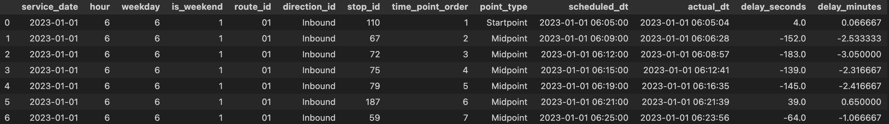

## Description
Most of the college students use MBTA as commution method. However, because of the frequent delay of MBTA‘ transit vehicles, students usually suffer from it, being late to the class or even missing the final exam. MBTA delays because of multiple factors, and we want to figure it out, studying the long-term pattern of MBTA. We are interested in investigating the weight of different factors that can affect MBTA's arrival time.

## Goal
 
### Primary Goal
Predict the binary result if MBTA bus will delay or not based factors we consider.

### Research Goal 
Study the relationships between delay and different factors.

## Data Sources

### MBTA Open Data Portal
[https://mbta-massdot.opendata.arcgis.com/](https://mbta-massdot.opendata.arcgis.com/)  
Provides open public data on MBTA bus operations for **2023–2024**, including:
- Scheduled and actual arrival/departure times  
- Routes, stops, and direction information  

### Meteostat Developers
[https://dev.meteostat.net/](https://dev.meteostat.net/)  
Provides corresponding **weather-related data** for the Boston area from **2023–2024**, including:
- Temperature, humidity, precipitation, pressure, wind speed and direction, cloud cover, and encoded weather conditions  

## Dataset Overview
Before cleaning, the raw data consists of:
- 24 monthly MBTA bus tables (2023–2024)  

- 2 yearly weather tables (2023–2024)  

These tables are later processed and combined into a single integrated dataset.  

---

## Bus Data Processing

The first step focuses on cleaning and preparing the MBTA bus dataset.

1. **Merging and Cleaning**  
   All 24 monthly MBTA bus CSV files are merged into a single dataset.  
   Duplicate rows are removed to ensure data consistency.

 **→ Code snippet here:**
   ```python
    files_2023 = glob.glob(os.path.join(path_2023, "*.csv"))  #match and get all csv files under the variables
    files_2024 = glob.glob(os.path.join(path_2024, "*.csv"))
    all_files = files_2023 + files_2024 #merge two files
    dataframes = []
    for i, file in enumerate(all_files):
    df = pd.read_csv(file)
    dataframes.append(df)   
    bus_all = pd.concat(dataframes, ignore_index=True)   # merge the files by rows, ignore_index= True: generate new row numbers
    bus_all = bus_all.drop_duplicates() #remove all duplicate row information   
```

2. **Timestamp Conversion**  
   All time-related columns (e.g., `scheduled_dt`, `actual_dt`, `service_date`) are converted into standardized datetime type  and format to allow for temporal operations.

3. **Feature Creation**  
   A new column, `delay`, is computed as the difference between actual and scheduled arrival times.  
   Additionally, time-based features including `hour`, `weekday`, and `is_weekend` are extracted to capture potential patterns related to rush hours and weekend effects.

**→ Code snippet here:**
```python
bus_all["hour"] = bus_all["scheduled_dt"].dt.hour
bus_all["weekday"] = bus_all["scheduled_dt"].dt.weekday  # 0=Mon, 6=Sun
bus_all["is_weekend"] = bus_all["weekday"].isin([5,6]).astype(int)

```

4. **Column Selection**  
   Only relevant and reliable variables — such as service date, route, stop, direction, and computed delay — are retained.  
   The cleaned bus dataset is saved for later modeling and integration.

partial output:

---

## Weather Data Processing

Before integration, the Meteostat weather data undergoes a preprocessing stage to ensure compatibility with the bus dataset.

1. **Data Combination and Cleaning**  
   The 2023 and 2024 weather tables are combined into one dataset.  
   Unnecessary or redundant columns (e.g., metadata fields ending in `_source`) are removed.

2. **Timestamp Alignment**  
   Hour-level timestamps are created by combining year, month, day, and hour columns.  
   These timestamps will later be used to match the bus records based on event hour.

**→ Code snippet here:**
```python
    weather_raw["timestamp_hour"] = pd.to_datetime(
    weather_raw[["year", "month", "day", "hour"]]
)
```
3. **Feature Selection and Labeling**  
   Key variables such as temperature, humidity, precipitation, and wind speed are retained.  
   Weather condition codes are mapped to human-readable labels (e.g., *Clear*, *Cloudy*, *Rain*, *Snow*) for improved readability.

The resulting weather dataset is concise, structured, and ready to be joined with the bus dataset.

---

## Data Integration

After both datasets are cleaned, the next step is to combine them into a single integrated table.

1. **Timestamp Matching**  
   Bus timestamps are rounded down to the nearest hour to align with hourly weather records.  
   Each bus record is then matched to the corresponding weather conditions based on the same hour.

2. **Merging**  
   The cleaned bus dataset and weather dataset are merged using a left join on the matching hour keys.  
   This ensures that every bus record includes the relevant environmental context.

3. **Post-Merge Cleaning**  
   Duplicate and missing rows are removed to maintain data quality.  
   The merged dataset is then saved for modeling.

---

## Final Integrated Dataset

The final dataset contains approximately **46 million rows** and **22 variables**, integrating both operational and environmental features.

- **Bus-related variables:** route ID, stop ID, direction ID, scheduled and actual timestamps, delay in seconds/minutes.  
- **Time-related variables:** hour, weekday, weekend indicator.  
- **Weather-related variables:** air temperature, relative humidity, precipitation, wind speed and direction, air pressure, cloud cover, and weather condition label.


---

